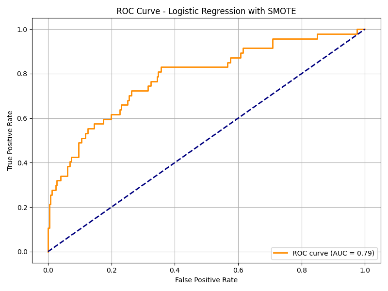

# Employee Attrition Prediction



This project focuses on predicting employee attrition using machine learning techniques. The goal is to identify employees who are likely to leave the company, helping HR teams take proactive measures.

## Table of Contents
- [Overview](#overview)
- [Dataset](#dataset)
- [Preprocessing](#preprocessing)
- [Modeling](#modeling)
- [Evaluation](#evaluation)
- [Improvements](#improvements)
- [Installation](#installation)
- [Results](#results)
- [Author](#author)

## Overview
This project uses a structured dataset to build classification models for predicting whether an employee will leave the organization. It uses both class balancing techniques and model optimization to improve recall for the minority class (attrition = yes).

## Dataset
- Source: IBM HR Analytics Employee Attrition & Performance
- Records: 1,470
- Features: 35
- Target: Attrition (Yes/No)

## Preprocessing
- Encoded categorical variables using one-hot encoding
- Handled class imbalance using *SMOTE*
- Scaled features for logistic regression

## Modeling
Trained and compared the following models:
- *Logistic Regression* with threshold tuning
- *Random Forest Classifier*
- *Random Forest + RandomizedSearchCV* for hyperparameter tuning

## Evaluation
- Used *accuracy, **recall, **precision, and **f1-score*
- Focused on improving recall for detecting employees who are likely to leave
- Used threshold tuning in logistic regression to balance precision-recall

### Confusion Matrix (Best Model - Tuned Random Forest):
[[239   8]
[ 37  10]]

### Classification Report (Attrition = 1 "Yes"):
- Precision: 0.56  
- Recall: 0.21  
- F1-score: 0.31  

## Improvements
- Applied *SMOTE* to balance the dataset
- Tuned hyperparameters using *RandomizedSearchCV*
- Evaluated models across multiple thresholds for better minority class detection

## Installation

1. *Clone the repository:*
```bash
git clone https://github.com/Taushin-sys/employee-attrition-prediction.git
cd employee-attrition-prediction

2.	(Optional) Create a virtual environment:
python -m venv venv
source venv/bin/activate  # On Windows: venv\Scripts\activate

3.	Install dependencies:
pip install -r requirements.txt

Results

Best results were achieved with:
	•	SMOTE + Random Forest + Hyperparameter Tuning

Author

Sayed Taushin (Tosh)